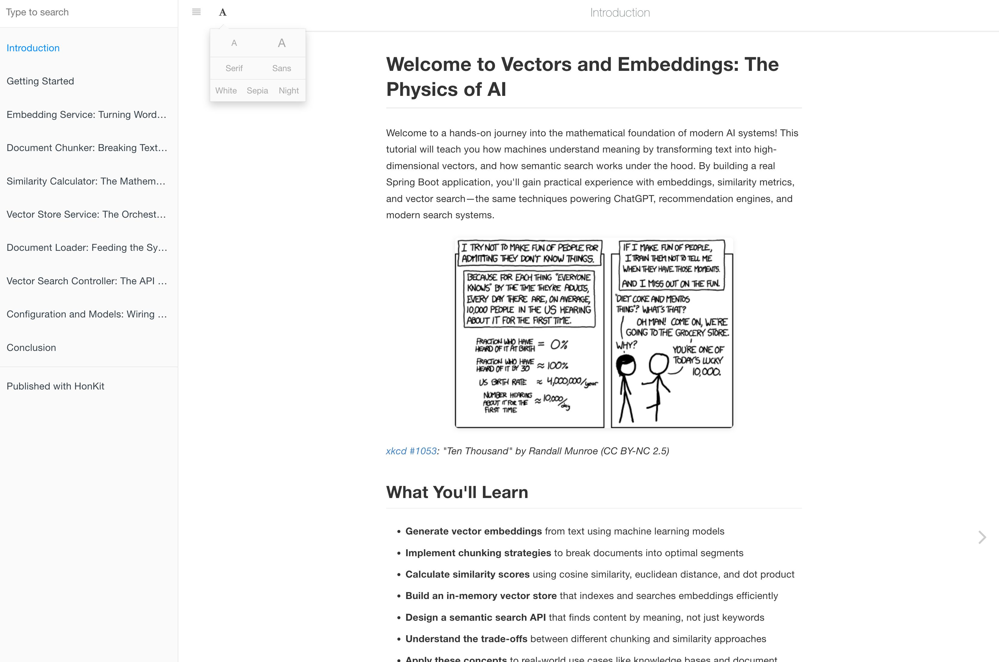

# Tutorial Skill

This skill generates code tutorials from source code using Large Language Models (LLMs). It analyzes the source code, identifies abstractions and relationships, and generates a structured tutorial with chapters.
It has various commands such as `analysis`, `build` and `preview`. 

### Quick start
```bash
# 1. Navigate to your project
cd /path/to/your/project

# 2. Install the skill locally
npx @sshaaf/tutorial-skill install

# 3. Reload your coding agent (e.g., restart Claude Code CLI or reload IDE)

# 4. Generate tutorial (in Claude Code)
/tutorial build

# 5. Preview the tutorial
# Option A: View markdown files directly (VS Code, etc.)
# Option B: Preview as HTML with HonKit
/tutorial preview
```

**What happens**:
- Step 2 creates `.claude/tutorial/` in your project
- Step 4 generates tutorial files in `./docs/tutorial/`
- Step 5 serves an interactive HTML site at `http://localhost:4000`




## Pipeline Overview

### Analyze Mode (3 stages)
1. **Code Discovery**: Find and read source files
2. **Identify Abstractions**: Extract core concepts
3. **Analyze Relationships**: Map component interactions

### Build Mode (6 stages)
1. **Code Discovery**: Find and read source files
2. **Identify Abstractions**: Extract core concepts
3. **Analyze Relationships**: Map component interactions
4. **Organize Chapters**: Determine pedagogical order
5. **Generate Metadata**: Create tutorial info
6. **Write Content**: Generate introduction + chapters

## Language Support

Works with any programming language:
- Java, Python, JavaScript/TypeScript, Go, C#, Ruby, PHP, Rust, Kotlin etc.

## Commands

### `/tutorial analyze`
Fast codebase analysis with architecture diagrams
- **Time**: 2-5 minutes
- **Output**: Interactive summary + Mermaid diagram
- **Use for**: Understanding codebases, onboarding, planning refactors

### `/tutorial build`
Complete tutorial generation with chapters
- **Time**: 10-30 minutes
- **Output**: Multiple Markdown files + HonKit-ready docs scaffolding
- **Use for**: Creating learning materials, documentation, training resources

### `/tutorial preview`
Local tutorial preview with HonKit
- **Time**: 5-30 seconds to start
- **Output**: Local docs site (usually `http://localhost:4000`)
- **Use for**: Reviewing generated docs before publishing

### `/tutorial doctor`
Diagnostics for local preview/runtime + docs scaffolding
- **Time**: ~10-30 seconds
- **Output**: Pass/fail checklist
- **Use for**: Verifying HonKit runtime + `book.json` before publishing

### Installation

```bash
# Navigate to your project directory
cd /path/to/your/project

# Install via NPM (recommended)
npx @sshaaf/tutorial-skill install
```

This creates `.claude/tutorial/` in your project directory with:
- Skill definition (SKILL.md)
- Templates for tutorial generation
- CLI tools for preview/build
- Bundled HonKit runtime (`.runtime/honkit`)

**Benefits of local installation**:
- ✅ Version control templates with your project
- ✅ Customize templates per project
- ✅ Multiple projects can have different versions
- ✅ No global state - everything is project-local

### Updating

```bash
# Navigate to the project directory where you installed the skill
cd /path/to/your/project

# Check for updates
npx @sshaaf/tutorial-skill update --check

# Update to latest version (with automatic backup)
npx @sshaaf/tutorial-skill update

# Update without backup
npx @sshaaf/tutorial-skill update --no-backup

# Force update even if on latest version
npx @sshaaf/tutorial-skill update --force
```

**Important notes about updates**:
- ⚠️ Updates **overwrite** files in `.claude/tutorial/` including templates
- ✅ Automatic backup created at `.claude/tutorial/.backup/` before update
- ✅ HonKit runtime (`.runtime/honkit/`) is preserved
- ✅ Rolls back automatically if update fails
- 💡 If you customized templates, backup is your safety net

**Workflow for customized templates**:
```bash
# Before update - manually save your customizations
cp -r .claude/tutorial/templates .claude/tutorial/templates.custom

# Run update
npx @sshaaf/tutorial-skill update

# After update - restore specific customizations
# (merge changes as needed)
diff -r .claude/tutorial/templates .claude/tutorial/templates.custom
```

**Alternative methods:**
```bash
# Manual install from source (run from project directory)
cp -r /path/to/tutorial-skill .claude/tutorial

# Or clone directly
git clone https://github.com/sshaaf/tutorial-skill .claude/tutorial
```

Note: alternative/manual installation methods do not bootstrap the bundled HonKit runtime; use the NPM installer for the default preview workflow.

**Version control**:
```bash
# Option 1: Exclude from git (recommended for most users)
echo ".claude/" >> .gitignore

# Option 2: Commit templates for team customization
git add .claude/tutorial/templates/
git add .claude/tutorial/SKILL.md
git commit -m "Add customized tutorial templates"
```

**Managing multiple projects**:
```bash
# Each project has its own local installation
cd ~/projects/app-A
npx @sshaaf/tutorial-skill install  # Creates app-A/.claude/tutorial/

cd ~/projects/app-B
npx @sshaaf/tutorial-skill install  # Creates app-B/.claude/tutorial/

# Customize templates differently per project
vim ~/projects/app-A/.claude/tutorial/templates/honkit/index.md
vim ~/projects/app-B/.claude/tutorial/templates/honkit/index.md

# Updates are per-project
cd ~/projects/app-A
npx @sshaaf/tutorial-skill update  # Updates only app-A

cd ~/projects/app-B
npx @sshaaf/tutorial-skill update  # Updates only app-B
```

### Usage

```bash
# Quick analysis
/tutorial analyze .

# With path
/tutorial analyze ./src/main/java

# Full tutorial
/tutorial build .

# With output directory
/tutorial build --output ./docs/tutorial

# Preview generated tutorial in Claude mode
/tutorial preview ./docs/tutorial

# Diagnose local preview/runtime/docs scaffolding
/tutorial doctor ./docs/tutorial

# Initialize docs files for HonKit
npx @sshaaf/tutorial-skill init --dir ./docs/tutorial

# Preview locally with HonKit
npx @sshaaf/tutorial-skill preview --dir ./docs/tutorial

# Build static site with HonKit
npx @sshaaf/tutorial-skill build --dir ./docs/tutorial

# Diagnose runtime/plugin setup
npx @sshaaf/tutorial-skill doctor --dir ./docs/tutorial
```

`honkit` is the default docs engine. `--engine honkit` is optional and supported for future engine compatibility.

### Developer / pre-publish CLI (git checkout)

If you are testing changes **before publishing** to npm, use the repo CLI (not `npx`), because `npx` resolves the **published** package version:

See `DEV_TESTING.md` for the short checklist.

## Tips

### For Best Analysis
- Focus on specific directories for large projects
- Exclude test files (done automatically)
- Ask follow-up questions after analysis

### For Best Tutorials
- Specify target audience (beginner/intermediate/advanced)
- Review chapter order before generation
- Regenerate specific chapters if needed

## Documentation

- **SKILL.md**: Complete skill implementation
- **DEV_TESTING.md**: Local testing checklist for maintainers
- **Installation**: See parent directory QUICK-START.md
- **Comparison**: See parent directory SKILLS-README.md

## Based On

Extracted from [Waver LLM](https://github.com/sshaaf/waver-llm) by Shaaf Syed.

## License

MIT License (same as Waver LLM)
