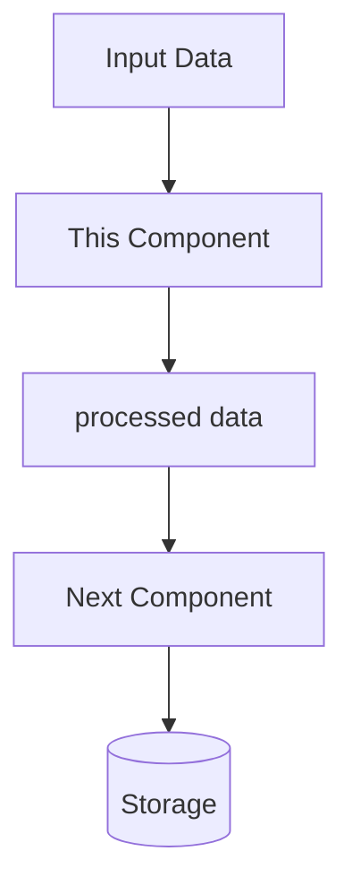

# Tutorial Generator

## Instructions

### Overview

This skill generates comprehensive, beginner-friendly tutorials from any codebase using a 6-stage pipeline.

**Command**: `/tutorial build`

**Supported arguments**:
  - Path: `/tutorial build ./src/main/java`
  - Output: `/tutorial build --output ./docs`
  - Language: `/tutorial build --language python`
  - Focus: `/tutorial build --focus services`
  - Engine: `/tutorial build --engine antora` (default: honkit)

Parse arguments flexibly - accept both flags and positional arguments.

**Engine Options**:
  - `honkit` (default): Generates Markdown files compatible with HonKit static site generator
  - `antora`: Generates AsciiDoc files compatible with Antora documentation system

---

### Build Mode (`/tutorial build`)

**Purpose**: Transform any codebase into comprehensive, beginner-friendly tutorials with architecture analysis.

**Use cases**: Learning materials, code documentation, training resources, educational content, onboarding

**Pipeline** (6 stages):

#### Stage 1: Code Discovery

1. **Determine output engine**:
   - Parse `--engine` flag from command args (default: `honkit`)
   - Supported values: `honkit` (Markdown), `antora` (AsciiDoc)
   - Set template directory based on engine:
     - HonKit: `.claude/tutorial/templates/honkit/`
     - Antora: `.claude/tutorial/templates/antora/`
   - Store engine choice for use in all subsequent stages

2. **Determine project path**:
   - Use path from command args if provided, otherwise ask user
   - Auto-detect primary language from file extensions

3. **Detect multi-module structure**:

   Check for common multi-module patterns:

   **Maven multi-module**:
   - Root `pom.xml` with `<modules>` section
   - Multiple subdirectories each containing `pom.xml`

   **Gradle multi-module**:
   - `settings.gradle` or `settings.gradle.kts` with `include` statements
   - Multiple subdirectories with `build.gradle` files

   **npm/Yarn workspaces**:
   - Root `package.json` with `workspaces` field
   - Directories like `packages/*/package.json`

   **Go modules**:
   - Multiple `go.mod` files in subdirectories
   - Directory structure like `cmd/`, `internal/`, `pkg/`

   **Monorepo patterns**:
   - Common directories: `packages/`, `apps/`, `services/`, `modules/`, `libs/`
   - Presence of `lerna.json`, `nx.json`, `pnpm-workspace.yaml`

   **.NET solutions**:
   - `*.sln` file listing multiple projects
   - Multiple `*.csproj` files in subdirectories

   **Python packages**:
   - Multiple `setup.py` or `pyproject.toml` in subdirectories
   - Directory structure with package folders

   **If modules detected**, ask user:
   ```
   🔍 Detected multi-module project with N modules:

   Modules found:
   1. user-service (./services/user-service) - Java/Spring Boot
   2. payment-service (./services/payment-service) - Java/Spring Boot
   3. notification-service (./services/notification-service) - Java/Spring Boot

   How would you like to generate the tutorial?

   A) Generate comprehensive tutorial covering ALL modules
      - Each module becomes a chapter with sub-chapters
      - Hierarchical SUMMARY.md structure
      - Good for: understanding the full system architecture

   B) Generate tutorial for a SPECIFIC module only
      - Focus on one module in depth
      - Good for: learning one service at a time

   Please choose A or B (or specify module name/number):
   ```

   **If user chooses ALL modules (A)**:
   - Set `mode = "multi-module"`
   - Store module list with paths and metadata
   - Process each module through all stages separately
   - Generate hierarchical structure

   **If user chooses SPECIFIC module (B)**:
   - Ask which module to focus on
   - Set `mode = "single-module"`
   - Update project path to the selected module
   - Continue with normal single-module flow

   **If no modules detected**:
   - Set `mode = "single-module"`
   - Continue with current directory

3. **Find source files using Glob** (exclude test/build directories):
   - Java: `**/*.java`, Python: `**/*.py`, JS/TS: `**/*.{js,ts,jsx,tsx}`
   - Go: `**/*.go`, C#: `**/*.cs`, Ruby: `**/*.rb`, Rust: `**/*.rs`, PHP: `**/*.php`

3. **Discover build and configuration files**:
   - Build systems:
     - Java: `pom.xml`, `build.gradle`, `build.gradle.kts`, `settings.gradle`
     - JavaScript/TypeScript: `package.json`, `package-lock.json`, `yarn.lock`, `tsconfig.json`
     - Python: `requirements.txt`, `setup.py`, `pyproject.toml`, `Pipfile`
     - Go: `go.mod`, `go.sum`
     - Rust: `Cargo.toml`, `Cargo.lock`
     - Ruby: `Gemfile`, `Gemfile.lock`
     - .NET: `*.csproj`, `*.sln`
     - PHP: `composer.json`
   - Configuration files:
     - Environment: `.env.example`, `.env.sample`, `.env.template`, `config/*.properties`, `application.yml`, `application.properties`
     - Docker: `Dockerfile`, `docker-compose.yml`, `docker-compose.yaml`
     - Scripts: `*.sh`, `*.bat`, `Makefile`, `scripts/*`
   - Documentation: `README.md`, `CONTRIBUTING.md`, `docs/`

4. **Handle large codebases**: If >50 files found, ask to analyze all or focus on subdirectory

5. **Read files** with Read tool and report: "Found {N} source files totaling {LOC} lines of code, plus {M} configuration files"

#### Stage 2: Identify Core Abstractions

**Task**: Identify the core abstractions - the main concepts, classes, modules, or patterns that define this codebase's architecture.

**Approach**: Analyze the code as a senior software architect would. For each abstraction, determine:

1. **name**: A concise, clear name for the concept
2. **description**: A 2-3 sentence explanation of what it does and why it exists (use simple, beginner-friendly language with analogies where helpful)
3. **category**: Classify as one of: "Model/Entity", "Service/Business Logic", "Controller/Handler", "Repository/Data Access", "Utility/Helper", "Configuration", "Interface/Contract", "Middleware", "Other"
4. **relevantFiles**: Array of file paths where this abstraction is primarily defined or used
5. **importance**: Rate as "core", "supporting", or "auxiliary"

**Requirements**:
- Focus on the most important abstractions
- Aim for 5-15 key concepts depending on codebase complexity
- Structure output as JSON: `{"abstractions": [...]}`

**Input to analyze**:
- Project Name: {project_name or "Unknown Project"}
- Primary Language: {detected_language}
- Codebase: {concatenated_file_contents}

**Example output structure**:
```json
{
  "abstractions": [
    {
      "name": "UserService",
      "description": "Handles all business logic related to user management, including registration, authentication, and profile updates. Think of it as the conductor that orchestrates user-related operations.",
      "category": "Service/Business Logic",
      "relevantFiles": ["src/services/UserService.java", "src/services/AuthService.java"],
      "importance": "core"
    }
  ]
}
```

**Display Results**: Show grouped abstractions (Core, Supporting, Auxiliary) with brief descriptions.

#### Stage 3: Analyze Relationships

**Task**: Identify how the identified components interact with each other.

**Approach**: Analyze as a software architect would. Provide:

1. **summary**: A 3-5 sentence high-level overview of:
   - The project's main purpose
   - The architectural style (MVC, layered, microservices, etc.)
   - The primary data flow or request flow
   - Use markdown formatting with **bold** for key concepts

2. **relationships**: Array of relationships between abstractions, where each includes:
   - **from**: Source abstraction index and name (format: "0 # AbstractionName")
   - **to**: Target abstraction index and name (format: "1 # OtherAbstraction")
   - **description**: Short phrase describing the relationship (e.g., "uses for data access", "extends", "validates input for", "sends events to")
   - **type**: Classify as "dependency", "inheritance", "composition", "calls", "data-flow", or "event"

**Requirements**:
- Every abstraction must appear in at least one relationship
- Focus on significant relationships - exclude trivial ones
- Prefer relationships backed by actual code interactions (method calls, field references)
- Limit to ~2-3 relationships per abstraction to avoid clutter
- Return JSON: `{"summary": "...", "relationships": [...]}`

**Input to analyze**:
- Project: {project_name}
- Language: {language}
- Abstractions (numbered): {numbered_list_of_abstractions_with_descriptions}
- Codebase: {concatenated_file_contents}

**Display Results**: Show project overview summary, Mermaid architecture diagram, and key relationships list.

#### Stage 4: Organize Chapters

**Goal**: Determine pedagogical order for teaching concepts (foundational → data access → business logic → presentation → cross-cutting concerns).

**Approach**: Organize abstractions into teaching order, considering dependencies and pedagogical flow. Create descriptive chapter titles for each abstraction.

**Chapter Title Requirements**:
- Use Chicago Manual of Style title case capitalization (see capitalization-guide.md)
- Format: "Component Name: Descriptive Subtitle" or "Verb + Object + Context"
- Examples: "User Service: The Heart of Authentication", "Understanding the Repository Pattern", "Building Your First API Endpoint"
- Capitalize: First/last words, major words (nouns, verbs, adjectives, adverbs)
- Lowercase: articles (a, an, the), conjunctions (and, but, or), prepositions (in, on, at, to, from, with, of)

**User Confirmation**: Show suggested chapter order with properly capitalized titles and ask user to approve or modify.

#### Stage 5: Generate Tutorial Metadata

**Goal**: Generate metadata for the tutorial including information needed for book.json template.

**Required fields**:
- `title` - Concise tutorial title (used in book.json)
- `description` - 1-2 sentence description of what learners will build/understand (used in book.json)
- `difficulty` - "Beginner", "Intermediate", or "Advanced" (used in book.json)
- `estimatedTime` - Estimated completion time (e.g., "3.5 hours") (used in book.json)
- `tags` - Array of relevant technology/concept tags
- `prerequisites` - Array of prerequisite knowledge/tools
- `author` - Optional author name (defaults to "Generated by Claude Code")

**Approach**: Create tutorial metadata JSON with all required fields based on the analyzed codebase.

**Display**: Show generated metadata to user for confirmation.

#### Stage 6: Write Tutorial Content

**Goal**: Generate setup guide, individual chapters, and conclusion as Markdown files.

This stage creates:
- **Getting Started** (01-getting-started.md): Setup and configuration guide
- **Code Chapters** (02-NN-*.md): One chapter per abstraction from Stage 2
- **Conclusion** (conclusion.md): Synthesis, next steps, and resources

**6a. Generate Getting Started Chapter**: Create `01-getting-started.md` by analyzing build and configuration files discovered in Stage 1:

**Build System Analysis**:
- Identify build tool (Maven, Gradle, npm, pip, cargo, etc.) from discovered files
- Determine build/run commands:
  - Maven: `mvn clean install`, `mvn spring-boot:run`
  - Gradle: `./gradlew build`, `./gradlew bootRun`
  - npm/yarn: `npm install`, `npm start` or `npm run dev`
  - Python: `pip install -r requirements.txt`, `python app.py`
  - Go: `go mod download`, `go run main.go`
  - Rust: `cargo build`, `cargo run`
  - .NET: `dotnet restore`, `dotnet run`
- Extract version requirements from build files (Java version, Node version, Python version, etc.)

**Configuration Analysis**:
- Check `.env.example`, `.env.sample`, or similar for required environment variables
- Parse `application.properties`, `application.yml`, `config/*` for configuration patterns
- Identify required API keys, database URLs, or external service credentials
- Note any default values or placeholder patterns
- List which variables are required vs optional

**Infrastructure Setup**:
- Check for `docker-compose.yml` - if present, explain how to run (`docker-compose up`)
- Identify shell scripts in `scripts/` or project root (setup scripts, database migrations)
- Look for `Makefile` with useful targets
- Check for database initialization scripts (`.sql`, `.sh`, migrations)

**Template Usage**:
- A template is available based on the selected engine:
  - HonKit: `.claude/tutorial/templates/honkit/getting-started.md`
  - Antora: `.claude/tutorial/templates/antora/getting-started.adoc`
- The template has placeholders like `{{PROJECT_NAME}}`, `{{BUILD_COMMANDS}}`, etc.
- Use this template as a structural guide, but generate content based on actual analysis of build and configuration files

**Chapter Structure for Getting Started**:
1. **Prerequisites** - Required tools and versions (JDK, Node, Python, Docker, etc.)
2. **Clone and Setup** - How to clone/download and initial setup steps
3. **Build System** - Explanation of build tool and how to build the project
4. **Configuration** - Environment variables to set, config files to create
5. **Infrastructure** - Docker compose or other services to start
6. **Running Locally** - Step-by-step commands to run the application
7. **Verification** - How to verify it's working (URLs to visit, expected output)
8. **Troubleshooting** - Common issues and solutions
9. **Practice Exercise** - Hands-on verification exercise (3-4 tasks)

**Practice Exercise for Getting Started**:
- `{{SETUP_PRACTICE_EXERCISE}}` - Numbered list of verification tasks (e.g., change a log message, modify a config value, restart and verify)
- `{{SETUP_EXPECTED_OUTCOME}}` - What should happen after completing the exercise
- `{{SETUP_HINTS}}` - Helpful hints for finding files or running commands

**Example tasks**:
1. Locate the main application file and change a log message
2. Rebuild/restart the application
3. Verify the change appears in the logs/output
4. Bonus: Change a configuration value and observe the effect

**Navigation placeholders**:
- `{{PREV_CHAPTER_LINK}}` - Link back to introduction: `👈 **[Previous: Introduction](README.md)**`
- `{{NEXT_CHAPTER_LINK}}` - Link to first code chapter: `👉 **[Next: Chapter 2 - ComponentName](02-component-name.md)**`

Use code blocks with proper syntax highlighting for all commands and configuration examples.

**6b. Generate Code Chapters**: For each abstraction in order, create a chapter file using the appropriate template:
- HonKit: `{N:02d}-{chapter-name}.md` using `.claude/tutorial/templates/honkit/chapter-template.md`
- Antora: `chapter-{N:02d}.adoc` using `.claude/tutorial/templates/antora/chapter-template.adoc`

**Template placeholders to replace**:
- `{{CHAPTER_TITLE}}` - Descriptive chapter title in Chicago Manual of Style title case (e.g., "User Service: The Heart of Authentication", "Understanding the Repository Pattern"). See capitalization-guide.md for rules.
- `{{CHAPTER_INTRO_WITH_ANALOGY}}` - 2-3 sentences introducing the component with a relatable analogy
- `{{COMPONENT_NAME}}` - Name of the abstraction/component
- `{{COMPONENT_EXPLANATION}}` - Clear explanation of what this component is and its purpose
- `{{HOW_IT_WORKS_EXPLANATION}}` - Description of the component's operational flow
- `{{KEY_RESPONSIBILITIES}}` - Bulleted list of main responsibilities
- `{{FLOW_DESCRIPTION}}` - 2-3 sentences describing how data flows through this component
- `{{FLOW_DIAGRAM}}` - Mermaid flowchart showing data flow and transformations (see flow-diagram-examples.md)
- `{{CODE_SECTION_N_TITLE}}` - Titles for different code sections (methods, classes, etc.)
- `{{CODE_SECTION_N_EXPLANATION}}` - Explanation before each code snippet
- `{{LANGUAGE}}` - Programming language for syntax highlighting
- `{{CODE_SNIPPET_N}}` - Actual code excerpts from the codebase
- `{{CODE_SNIPPET_N_BREAKDOWN}}` - Line-by-line or concept explanation after each snippet
- `{{ADDITIONAL_CODE_SECTIONS}}` - More code sections as needed (repeat the pattern)
- `{{RELATIONSHIP_DESCRIPTION}}` - How this component relates to others
- `{{RELATIONSHIP_DIAGRAM}}` - Optional Mermaid diagram showing relationships
- `{{DETAILED_RELATIONSHIP_EXPLANATIONS}}` - Detailed explanation of each relationship
- `{{KEY_POINTS}}` - Bulleted list of main takeaways
- `{{PRACTICE_EXERCISE}}` - Numbered list of hands-on tasks (3-5 tasks with progressive difficulty)
- `{{EXPECTED_OUTCOME}}` - What learners should achieve after completing the exercise
- `{{HINTS}}` - Bulleted list of helpful hints (2-3 hints)
- `{{SOLUTION_LINK_OR_EXPLANATION}}` - Brief explanation or approach to solving the exercise
- `{{PREV_CHAPTER_LINK}}` - Navigation link to previous chapter
- `{{NEXT_CHAPTER_LINK}}` - Navigation link to next chapter

**Navigation format**:
- Previous: `👈 **[Previous: Chapter N - ComponentName](0N-component-name.md)**`
- Next: `👉 **[Next: Chapter N - ComponentName](0N-component-name.md)**`
- For last code chapter before conclusion: `👉 **[Next: Conclusion](conclusion.md)**`
- If no conclusion, omit next link on last chapter

**Chapter requirements**:
- Use beginner-friendly language with analogies
- Include 2-4 code snippets with detailed explanations
- Reference related components from earlier chapters
- Keep consistent structure across all chapters

**Flow Diagram requirements**:
- Use Mermaid `graph TD` (top-down) or `graph LR` (left-right) syntax
- Show how data enters the component, transforms, and exits
- Use `[brackets]` for intermediate data/results (e.g., `[text chunks]`, `[vector embeddings]`)
- Use `[Component Name]` for processes/services
- Use `[(Database)]` for storage/persistence
- Use `{Decision?}` for conditional branching
- Include data transformation labels between nodes
- Reference flow diagram examples based on engine:
  - HonKit: `templates/honkit/flow-diagram-examples.md`
  - Antora: `templates/antora/flow-diagram-examples.adoc` (note: use `[mermaid]` directive with `....` delimiters)
- Keep diagrams focused on this component's primary data flow (3-8 nodes typically)

**Flow Diagram examples**:


**Practice Exercise guidelines**:
- Create 3-5 numbered tasks with progressive difficulty
- Start with a simple modification to existing code
- Include a moderate task that extends functionality
- Add a "Bonus" task for extra practice (optional)
- Include a "Challenge" task for advanced learners (optional)
- Tasks should be concrete and actionable (e.g., "Add a method called X that does Y")
- Relate exercises to real-world use cases when possible
- Provide 2-3 hints without giving away the complete solution
- Expected outcome should describe what the code should do when working correctly
- Solution should guide the approach without providing complete code (encourage learning)

Generate sequentially to allow cross-referencing. Show progress for each chapter.

**6c. Generate Conclusion Chapter**: Create a final chapter using the appropriate template:
- HonKit: `conclusion.md` using `.claude/tutorial/templates/honkit/conclusion.md`
- Antora: `conclusion.adoc` using `.claude/tutorial/templates/antora/conclusion.adoc`

Follow effective conclusion principles from the template.

**IMPORTANT**: Always generate the conclusion chapter unless the user explicitly requests not to. The conclusion synthesizes learning and provides next steps, making tutorials more complete and valuable.

**Template placeholders** (based on Harvard Writing Center guidance):

**Opening & Synthesis**:
- `{{SYNTHESIS_OPENING}}` - 2-3 sentences that synthesize (not summarize) the tutorial's journey. Answer "So what?" - why this learning matters. Avoid generic congratulations; instead, reflect on what learners can now do that they couldn't before.
- `{{WHY_IT_MATTERS}}` - 1-2 paragraphs on broader significance: How does this knowledge apply beyond this specific project? What problems can learners now solve? Connect to real-world applications and industry relevance.
- `{{JOURNEY_REFLECTION}}` - Circle back to the introduction's promise. If intro said "you'll master X", reflect on how that was accomplished. Show transformation from beginning to end.

**Knowledge Synthesis**:
- `{{KEY_CONCEPTS_SYNTHESIS}}` - Bulleted list of major concepts, but with synthesis: group related concepts, show how they interconnect, highlight patterns that emerged across chapters
- `{{TRANSFERABLE_SKILLS}}` - Name specific transferable skills gained (e.g., "architectural thinking", "debugging distributed systems", "API design principles") that apply beyond this tutorial
- `{{DOMAIN}}` - The broader domain (e.g., "web development", "machine learning", "data engineering")

**Action-Oriented Next Steps**:
- `{{BUILD_PROJECT_CHALLENGE}}` - Specific, achievable project idea that combines multiple concepts from the tutorial. Include scope/complexity guidance.
- `{{CONTRIBUTION_PATH}}` - Concrete ways to contribute (fix bugs, improve docs, add features) with guidance on where to start
- `{{CONTRIBUTION_VALUE}}` - Why contributing matters (builds portfolio, deepens understanding, helps community)
- `{{ADVANCED_TOPICS}}` - 3-5 advanced topics to explore next, each with 1-sentence description of what it adds

**Resources & Support**:
- `{{CURATED_RESOURCES}}` - Short, curated list (3-5 items) of high-quality resources. Explain why each is valuable, not just links.
- `{{SUPPORT_CHANNELS}}` - Specific channels for help (Discord, forum, GitHub issues) with what type of questions to ask where

**Closing**:
- `{{CONCLUSION_ILLUSTRATION}}` - Relevant illustration (xkcd comic recommended) that celebrates achievement or validates the learning journey. Consult illustrations-guide.md and select from "Success & Completion" or topic-specific sections. Format: Image + attribution (see Illustration Selection section below)
- `{{CLOSING_REFLECTION}}` - 2-3 sentences that elevate beyond the tutorial: the mindset/approach that matters most, or the larger lesson
- `{{CIRCLE_BACK_TO_INTRO}}` - Reference a specific concept, question, or goal from the introduction to create closure
- `{{EMPOWERING_SENDOFF}}` - Final sentence that's empowering and forward-looking. Avoid clichés; be specific about what learners can now accomplish.

**Conclusion Writing Principles**:
- **Synthesize, don't summarize**: Show how concepts connect, don't just list what was covered
- **Answer "So what?"**: Explain why this knowledge matters in the real world
- **Provide closure**: Circle back to the introduction's promise
- **Look forward**: Point to next steps without introducing entirely new topics
- **End with impact**: Final words should be memorable and empowering

**Illustration Selection** (for both intro and conclusion):
- **REQUIRED**: Select appropriate illustrations for both intro and conclusion - do NOT leave these placeholders empty
- Consult illustrations guide based on engine:
  - HonKit: `templates/honkit/illustrations-guide.md`
  - Antora: `templates/antora/illustrations-guide.adoc`
- **For Introduction**: Choose images about learning, complexity, or starting journeys
  - Examples: xkcd #1053 "Ten Thousand" (learning), #519 "11th Grade" (feeling lost), #974 "The General Problem"
- **For Conclusion**: Choose images about mastery, achievement, or validation
  - Examples: xkcd #208 "Regular Expressions" (mastery), #1319 "Automation" (ROI), #353 "Python" (joy of tools)
- **Match theme to tutorial topic**:
  - APIs/Web Dev → xkcd #1481 "API", #927 "Standards"
  - Security/Auth → xkcd #327 "SQL Injection", #936 "Password Strength"
  - ML/AI → xkcd #1425 "Tasks"
  - DevOps/Automation → xkcd #1319 "Automation", #1205 "Is It Worth the Time?"
  - Git/Version Control → xkcd #1172 "Workflow"
  - Testing/Quality → xkcd #1513 "Code Quality", #1833 "Code Quality 2"
- **Format** (always include image + attribution on separate lines):
  ```markdown
  

  *[xkcd #NUMBER](https://xkcd.com/NUMBER/): "Title" by Randall Munroe (CC BY-NC 2.5)*
  ```
- Alternative sources if xkcd doesn't fit: unDraw (no attribution), Unsplash (credit photographer) - see guide for details
- Only omit illustrations if truly no relevant match exists (rare - the xkcd catalog covers most programming topics)

**Navigation placeholder**:
- `{{PREV_CHAPTER_LINK}}` - Link back to last code chapter: `👈 **[Previous: Chapter N - ComponentName](0N-component-name.md)**`

---

### Multi-Module Tutorial Generation

**If `mode = "multi-module"` from Stage 1**, follow this workflow:

**Core Principle**: Each module gets the EXACT SAME full tutorial treatment as single-module mode. The only difference is organization and navigation.

**What this means**:
- Run the complete 6-stage pipeline (Stages 2-6) for EACH module independently
- Each module gets: README, getting-started, ALL code chapters (one per abstraction), conclusion
- Generate content iteratively or in parallel for all modules
- Link everything together with hierarchical navigation (SUMMARY.md or nav.adoc)
- The result: A system of complete, standalone tutorials that can be learned together or separately

#### Processing Flow:

**For Module 1** (e.g., user-service):
1. Run Stage 2: Identify abstractions (UserController, UserService, UserRepository, etc.)
2. Run Stage 3: Analyze relationships within module
3. Run Stage 4: Organize chapters (UserController → UserService → UserRepository)
4. Run Stage 5: Generate metadata (module title, description, difficulty)
5. Run Stage 6a: Generate getting-started.md for this module
6. Run Stage 6b: Generate ALL code chapters (02-user-controller.md, 03-user-service.md, 04-user-repository.md, etc.)
7. Run Stage 6c: Generate conclusion.md for this module

**For Module 2** (e.g., payment-service):
- Repeat the EXACT SAME process as Module 1
- Generate complete tutorial: README → getting-started → chapters → conclusion

**For Module 3** (e.g., notification-service):
- Repeat the EXACT SAME process as Module 1
- Generate complete tutorial: README → getting-started → chapters → conclusion

**Then, create system-level files**:
- Top-level README.md (system overview)
- Top-level getting-started.md (system setup)
- Top-level conclusion.md (system synthesis)
- SUMMARY.md or nav.adoc (hierarchical navigation linking everything)

---

#### Detailed Steps:

1. **Run Stages 2-6 for each module independently** (as described above):
   - Each module gets the FULL tutorial generation treatment (same as single-module mode)
   - Stage 2: Identify abstractions within the module
   - Stage 3: Analyze relationships within the module
   - Stage 4: Organize chapters for the module
   - Stage 5: Generate metadata for the module
   - Stage 6a: Generate Getting Started chapter for the module
   - Stage 6b: Generate ALL code chapters for the module (one per abstraction)
   - Stage 6c: Generate Conclusion chapter for the module

2. **IMPORTANT: Each module is a complete, standalone tutorial**:
   - Each module should have its own:
     - README.md (module introduction/overview)
     - 01-getting-started.md (module-specific setup)
     - 02-{abstraction-1}.md (first abstraction chapter)
     - 03-{abstraction-2}.md (second abstraction chapter)
     - ...
     - NN-{abstraction-N}.md (last abstraction chapter)
     - conclusion.md (module conclusion/synthesis)
   - Generate content using the same quality and depth as single-module mode
   - Practice exercises, diagrams, and code examples for each chapter

3. **Organize output in module subdirectories**:
   ```
   tutorials/
     README.md                    # Top-level system introduction
     01-getting-started.md        # Global setup (all modules)
     user-service/                # Module 1 - COMPLETE TUTORIAL
       README.md                  # Module introduction
       01-getting-started.md      # Module-specific setup
       02-user-controller.md      # Code chapter
       03-user-service.md         # Code chapter
       04-user-repository.md      # Code chapter
       conclusion.md              # Module conclusion
     payment-service/             # Module 2 - COMPLETE TUTORIAL
       README.md                  # Module introduction
       01-getting-started.md      # Module-specific setup
       02-payment-controller.md   # Code chapter
       03-payment-service.md      # Code chapter
       04-payment-gateway.md      # Code chapter
       conclusion.md              # Module conclusion
     notification-service/        # Module 3 - COMPLETE TUTORIAL
       README.md                  # Module introduction
       01-getting-started.md      # Module-specific setup
       02-notification-handler.md # Code chapter
       03-email-sender.md         # Code chapter
       conclusion.md              # Module conclusion
     conclusion.md                # Overall system conclusion
     SUMMARY.md                   # Hierarchical navigation
     book.json                    # HonKit config (or antora.yml for Antora)
     styles/website.css           # HonKit only
   ```

4. **Generate module-specific README.md** for each module:
   - Use same index.md template structure
   - Scope to this module only:
     - Module name as title
     - Module-specific learning objectives
     - Module-specific architecture diagram
     - Module's abstractions only
     - Technical stack for this module
     - Prerequisites specific to this module
     - Navigation to first chapter in module (01-getting-started.md)

5. **Create hierarchical SUMMARY.md** (HonKit) or **nav.adoc** (Antora):

   **HonKit example**:
   ```markdown
   # Summary

   * [Introduction](README.md)
   * [Getting Started](01-getting-started.md)

   ## User Service

   * [Module Overview](user-service/README.md)
   * [Getting Started](user-service/01-getting-started.md)
   * [UserController](user-service/02-user-controller.md)
   * [UserService](user-service/03-user-service.md)
   * [UserRepository](user-service/04-user-repository.md)
   * [Conclusion](user-service/conclusion.md)

   ## Payment Service

   * [Module Overview](payment-service/README.md)
   * [Getting Started](payment-service/01-getting-started.md)
   * [PaymentController](payment-service/02-payment-controller.md)
   * [PaymentService](payment-service/03-payment-service.md)
   * [PaymentGateway](payment-service/04-payment-gateway.md)
   * [Conclusion](payment-service/conclusion.md)

   ## Notification Service

   * [Module Overview](notification-service/README.md)
   * [Getting Started](notification-service/01-getting-started.md)
   * [NotificationHandler](notification-service/02-notification-handler.md)
   * [EmailSender](notification-service/03-email-sender.md)
   * [Conclusion](notification-service/conclusion.md)

   * [Conclusion](conclusion.md)
   ```

   **Antora example** (nav.adoc):
   ```asciidoc
   .Tutorial Title
   * xref:index.adoc[Introduction]
   * xref:getting-started.adoc[Getting Started]

   .User Service
   * xref:user-service/index.adoc[Module Overview]
   * xref:user-service/getting-started.adoc[Getting Started]
   * xref:user-service/chapter-02.adoc[UserController]
   * xref:user-service/chapter-03.adoc[UserService]
   * xref:user-service/chapter-04.adoc[UserRepository]
   * xref:user-service/conclusion.adoc[Conclusion]

   .Payment Service
   * xref:payment-service/index.adoc[Module Overview]
   * xref:payment-service/getting-started.adoc[Getting Started]
   * xref:payment-service/chapter-02.adoc[PaymentController]
   * xref:payment-service/chapter-03.adoc[PaymentService]
   * xref:payment-service/chapter-04.adoc[PaymentGateway]
   * xref:payment-service/conclusion.adoc[Conclusion]

   .Notification Service
   * xref:notification-service/index.adoc[Module Overview]
   * xref:notification-service/getting-started.adoc[Getting Started]
   * xref:notification-service/chapter-02.adoc[NotificationHandler]
   * xref:notification-service/chapter-03.adoc[EmailSender]
   * xref:notification-service/conclusion.adoc[Conclusion]

   * xref:conclusion.adoc[System Conclusion]
   ```

   **Key points**:
   - Each module section shows ALL chapters for that module
   - Chapters are numbered within each module directory
   - Each module is a complete tutorial that can be extracted and used standalone
   - Navigation shows the hierarchical structure clearly

6. **Generate top-level README.md**:
   - Cover the entire multi-module system
   - High-level architecture showing module interactions
   - System-wide overview and learning objectives
   - List all modules with brief descriptions
   - Link to global Getting Started

7. **Generate top-level Getting Started** (01-getting-started.md):
   - Setup instructions for entire project (root-level dependencies)
   - How to run all modules (docker-compose, orchestration)
   - Cross-module configuration
   - High-level system architecture
   - Link to first module overview or module-specific getting started

8. **Generate module Getting Started** (for each module):
   - Module-specific dependencies and setup
   - How to run this module in isolation
   - Module-specific configuration
   - Development workflow for this module
   - Integration with other modules (if applicable)

9. **Generate module Conclusion** (for each module):
   - Use the same conclusion.md template
   - Synthesize learning for this module
   - Module-specific key takeaways
   - How this module fits in the larger system
   - Link to next module or system conclusion

10. **Navigation Links**:
   - **Within module chapters**: Navigate within module (prev/next within module)
     - Example in module chapter: `👈 **[Previous: UserController](02-user-controller.md)**` and `👉 **[Next: UserRepository](04-user-repository.md)**`
   - **Last chapter in module** (module conclusion): Link to next module's overview
     - Example: `👉 **[Next Module: Payment Service Overview](../payment-service/README.md)**`
   - **First chapter in module** (module getting-started): Link back to module overview
     - Example: `👈 **[Previous: User Service Overview](README.md)**`

11. **Generate top-level System Conclusion** (conclusion.md):
   - Use the same conclusion.md template
   - Synthesize learning across ALL modules
   - How modules work together as a system
   - System-level insights and architectural patterns
   - Cross-module design decisions and trade-offs
   - System-wide best practices
   - Next steps for extending or deploying the entire system
   - This is NOT a summary of individual module conclusions - it's a higher-level synthesis

**Benefits of this structure**:
- ✅ Users can learn the entire system progressively (start to finish)
- ✅ Each module is a COMPLETE, standalone tutorial (intro → getting-started → chapters → conclusion)
- ✅ Easy to extract: Copy one module's directory for standalone use without modifications
- ✅ Hierarchical navigation shows system organization in SUMMARY.md/nav.adoc
- ✅ Same quality and depth as single-module tutorials
- ✅ Learn modules in any order (each is self-contained)
- ✅ Module conclusions connect to the larger system
- ✅ System conclusion synthesizes cross-module patterns

---

#### Final Step: Create Navigation and Configuration Files

After generating chapters, create the navigation and configuration files based on the selected engine.

**CRITICAL TEMPLATE USAGE RULES**:
- ✅ **DO**: Read template files with Read tool and ONLY replace documented placeholders
- ✅ **DO**: Preserve all template structure, plugins, and configuration exactly as written
- ❌ **DO NOT**: Add extra plugins, config sections, or content not in the template
- ❌ **DO NOT**: Modify template structure or "improve" the configuration
- ❌ **DO NOT**: Hallucinate or invent content - use template + placeholder replacement ONLY

**Note**: Instructions below apply to **single-module** tutorials. For **multi-module** tutorials, see the Multi-Module section above for structure and organization.

**Choose the appropriate section based on the engine** (determined in Stage 1):

**1. Create README.md** from template:
   - Read template from: `.claude/tutorial/templates/honkit/index.md`
   - Replace placeholders:
     - `{{TUTORIAL_TITLE}}` - Tutorial title from metadata
     - `{{WELCOME_MESSAGE}}` - 2-3 sentence warm welcome explaining what this tutorial covers
     - `{{INTRO_ILLUSTRATION}}` - Relevant illustration (xkcd comic recommended) that sets the tone for learning. Consult illustrations-guide.md and select from "Learning & Development" or topic-specific sections. Format: Image + attribution (see Illustration Selection section below)
     - `{{LEARNING_OBJECTIVES}}` - Bulleted list of specific skills/concepts learners will master
     - `{{PROJECT_OVERVIEW}}` - 1-2 paragraphs describing the project's purpose and main functionality
     - `{{ARCHITECTURE_DIAGRAM}}` - Mermaid diagram from Stage 3 (architecture relationships)
     - `{{TECHNICAL_STACK}}` - Bulleted list of technologies, frameworks, and tools used (detected from Stage 1)
     - `{{TUTORIAL_STRUCTURE}}` - Numbered list of chapter titles with brief descriptions
     - `{{PREREQUISITES}}` - Bulleted list from metadata (programming knowledge, tools, concepts)
     - `{{TARGET_AUDIENCE}}` - 1-2 sentences describing intended audience based on difficulty level
     - `{{NEXT_CHAPTER_LINK}}` - Navigation link to first chapter: `👉 **[Next: Chapter 1 - Getting Started](01-getting-started.md)**`
   - Generate content that is beginner-friendly, encouraging, and sets clear expectations for what learners will accomplish
   - **Note**: README.md is the HonKit entry point (landing page) and uses the comprehensive index.md template

**2. Create SUMMARY.md**:

   **For single-module tutorials**:
   - Read template from: `.claude/tutorial/templates/honkit/SUMMARY.md`
   - Replace `{{CHAPTER_LINKS}}` with links to all chapter files:
     - First link should always be Getting Started: `* [Getting Started](01-getting-started.md)`
     - Followed by code chapters: `* [Chapter N - Chapter Title](0N-chapter-name.md)`, etc.
     - Last link should be conclusion chapter: `* [Conclusion](conclusion.md)`
     - Format: `* [Chapter Title](NN-chapter-name.md)`
     - One link per generated chapter in order

   **For multi-module tutorials**:
   - Generate hierarchical structure with module sections (see Multi-Module section above)
   - Use `##` headers for module names
   - Nest module chapters under their module section
   - Each module should have: `* [Module Overview](module-name/README.md)` followed by its chapters

   **For both**:
   - **IMPORTANT**: All chapter titles MUST use Chicago Manual of Style title case capitalization
   - See `templates/honkit/capitalization-guide.md` for complete rules and examples
   - Quick rules: Capitalize first/last words and major words; lowercase articles (a, an, the), conjunctions (and, but, or), and prepositions (in, on, at, to, from, with, of, etc.)

**3. Create book.json** from template:
   - **IMPORTANT**: Read the EXACT template from: `.claude/tutorial/templates/honkit/book.json`
   - **ONLY replace the following placeholders** - do NOT add any extra plugins, config, or sections:
     - `{{TUTORIAL_TITLE}}` - Tutorial title from metadata
     - `{{TUTORIAL_DESCRIPTION}}` - Tutorial description from metadata
     - `{{AUTHOR}}` - From metadata or default to "Generated by Claude Code"
     - `{{MODULE}}` - Default to "Module 01"
     - `{{DIFFICULTY}}` - From metadata
     - `{{ESTIMATED_TIME}}` - From metadata
   - **Do NOT add**: extra plugins, pluginsConfig sections, links sections, or any other content not in the template

**4. Copy styles** from template:
   - Copy `.claude/tutorial/templates/honkit/styles/website.css` to output directory's `styles/` folder
   - Creates `{output_dir}/styles/website.css` for custom HonKit styling

**Completion** (HonKit): Show summary with output directory, files created, stats, and preview instructions:
   ```
   Preview locally:
   npm install -g honkit
   cd {output_dir}
   honkit serve
   ```

---

#### Antora Engine (AsciiDoc)

If `--engine antora` was specified, follow these steps:

**1. Create antora.yml** from template:
   - **IMPORTANT**: Read the EXACT template from: `.claude/tutorial/templates/antora/antora.yml`
   - **ONLY replace the following placeholders** - do NOT add any extra fields or sections:
     - `{{MODULE_NAME}}` - Lowercase module identifier (e.g., "user-service", "tutorial")
     - `{{TUTORIAL_TITLE}}` - Tutorial title from metadata
     - `{{DIFFICULTY}}` - From metadata
     - `{{ESTIMATED_TIME}}` - From metadata
     - `{{AUTHOR}}` - From metadata or default to "Generated by Claude Code"
   - Write to: `{output_dir}/antora.yml`

**2. Create index.adoc** (landing page):
   - Read template from: `.claude/tutorial/templates/antora/index.adoc`
   - Replace placeholders (same as HonKit index.md but in AsciiDoc format):
     - `{{TUTORIAL_TITLE}}`, `{{TUTORIAL_DESCRIPTION}}`, `{{AUTHOR}}`
     - `{{LEARNING_OBJECTIVES}}`, `{{PREREQUISITES}}`
     - `{{DIFFICULTY}}`, `{{ESTIMATED_TIME}}`
   - Write to: `{output_dir}/modules/ROOT/pages/index.adoc`

**3. Create nav.adoc** (navigation sidebar):
   - Read template from: `.claude/tutorial/templates/antora/nav.adoc`
   - Replace `{{TUTORIAL_TITLE}}` with tutorial title
   - Replace `{{CHAPTER_NAVIGATION_ITEMS}}` with navigation items:
     - For single-module: `* xref:chapter-01.adoc[Chapter 1: Title]`
     - For multi-module: Use hierarchical structure with module sections
   - Write to: `{output_dir}/modules/ROOT/nav.adoc`
   - **IMPORTANT**: All chapter titles MUST use Chicago Manual of Style title case capitalization

**4. Create chapter files**:
   - Write all generated chapters to: `{output_dir}/modules/ROOT/pages/`
   - File names: `getting-started.adoc`, `chapter-01.adoc`, `chapter-02.adoc`, etc., `conclusion.adoc`
   - Use `.adoc` file extension (AsciiDoc format)
   - **Cross-references**: Use `xref:filename.adoc[Link Text]` syntax for internal links
   - **Mermaid diagrams**: Use `[mermaid]` directive with `....` delimiters:
     ```
     [mermaid]
     ....
     graph TD
       A --> B
     ....
     ```

**5. Create directories and copy supplemental UI**:
   - Create: `{output_dir}/modules/ROOT/images/` (for future diagrams)
   - Create: `{output_dir}/modules/ROOT/examples/` (for code examples)
   - Copy: `.claude/tutorial/templates/antora/supplemental-ui/` to `{output_dir}/supplemental-ui/`
     - This includes `partials/footer-scripts.hbs` for client-side Mermaid rendering

**Completion** (Antora): Show summary with output directory, files created, stats, and preview instructions:
   ```
   Preview locally:
   npm install -g @antora/cli @antora/site-generator-default

   Create antora-playbook.yml:
   cat > antora-playbook.yml << EOF
   site:
     title: {TUTORIAL_TITLE}
     start_page: {MODULE_NAME}:ROOT:index.adoc
   content:
     sources:
     - url: {GIT_REPO_ROOT}
       start_path: {output_dir}
       branches: HEAD
       worktrees: true
   ui:
     bundle:
       url: https://gitlab.com/antora/antora-ui-default/-/jobs/artifacts/HEAD/raw/build/ui-bundle.zip?job=bundle-stable
       snapshot: true
     supplemental_files: {output_dir}/supplemental-ui
   EOF

   antora antora-playbook.yml
   npx http-server build/site -p 8080
   ```

   **Important configuration notes**:
   - `start_page`: Use format `{MODULE_NAME}:ROOT:index.adoc` (not `ROOT::index.adoc`)
   - `url`: Should point to git repository root (e.g., `/path/to/repo` or `.` if playbook is at repo root)
   - `start_path`: Relative path from repo root to tutorial directory
   - `worktrees: true`: Includes uncommitted files (important for local preview)
   - `supplemental_files`: Points to supplemental-ui directory for Mermaid rendering

   **Note**: Mermaid diagrams are rendered client-side using Mermaid.js loaded from CDN via supplemental-ui/partials/footer-scripts.hbs.

---

### General Guidelines

**Templates**:
All tutorial templates are organized by output format at `.claude/tutorial/templates/`:

**HonKit Templates** (`templates/honkit/` - Markdown format):
- `book.json` - HonKit configuration with metadata placeholders (always use)
- `index.md` - Tutorial introduction/landing page template used for README.md generation (always use)
- `SUMMARY.md` - Table of contents template (always use)
- `getting-started.md` - Getting Started chapter template with practice exercise (use as structural guide)
- `chapter-template.md` - Code chapter template for abstraction chapters with practice exercises and flow diagrams (always use)
- `conclusion.md` - Conclusion chapter template with synthesis and forward-looking structure (always use - generates conclusion.md)
- `practice-exercise-examples.md` - Reference examples showing good practice exercise structure (read for inspiration)
- `flow-diagram-examples.md` - Reference examples of Mermaid flow diagrams showing data flow patterns (read for inspiration)
- `navigation-examples.md` - Reference examples showing proper navigation link formatting (read for guidance)
- `conclusion-examples.md` - Reference examples of effective conclusions based on Harvard Writing Center principles (read for guidance)
- `illustrations-guide.md` - Curated xkcd comics and alternative illustration sources with attribution guidelines (read for selecting relevant images)
- `capitalization-guide.md` - Chicago Manual of Style title case rules for all chapter titles (MUST follow for consistency)
- `styles/website.css` - Custom CSS for HonKit rendering (always copy to output)

**Antora Templates** (`templates/antora/` - AsciiDoc format):
- `antora.yml` - Antora component descriptor with metadata placeholders (always use)
- `index.adoc` - Tutorial introduction/landing page template (always use)
- `nav.adoc` - Navigation sidebar template (always use)
- `getting-started.adoc` - Getting Started chapter template with practice exercise (use as structural guide)
- `chapter-template.adoc` - Code chapter template for abstraction chapters with practice exercises and flow diagrams (always use)
- `conclusion.adoc` - Conclusion chapter template with synthesis and forward-looking structure (always use)
- `practice-exercise-examples.adoc` - Reference examples showing good practice exercise structure in AsciiDoc (read for inspiration)
- `flow-diagram-examples.adoc` - Reference examples of Mermaid flow diagrams in AsciiDoc format (read for inspiration)
- `navigation-examples.adoc` - Reference examples showing proper xref formatting in AsciiDoc (read for guidance)
- `conclusion-examples.adoc` - Reference examples of effective conclusions (read for guidance)
- `illustrations-guide.adoc` - Curated xkcd comics and alternative illustration sources (read for selecting relevant images)
- `capitalization-guide.md` - Chicago Manual of Style title case rules for all chapter titles (MUST follow for consistency)

All templates use `{{PLACEHOLDER}}` syntax for dynamic values.

**Engine-specific usage**:

**HonKit** (Markdown):
- **book.json, SUMMARY.md, chapter-template.md**: Always read the template, replace all placeholders with actual values from analysis/metadata, and write to output directory
- **index.md**: Read template and use it to generate README.md (the HonKit landing page) with all placeholders replaced
- **getting-started.md, conclusion.md**: Use as structural references, generate content based on actual analysis following the template structure
- **styles/website.css**: Copy to `{output_dir}/styles/` without modification
- **Output structure**: Flat directory with `README.md`, `SUMMARY.md`, `book.json`, `*.md` chapters, `styles/`
- File extension: `.md`

**Antora** (AsciiDoc):
- **antora.yml, nav.adoc, chapter-template.adoc**: Always read the template, replace all placeholders with actual values from analysis/metadata
- **index.adoc**: Read template and generate `modules/ROOT/pages/index.adoc` with all placeholders replaced
- **getting-started.adoc, conclusion.adoc**: Use as structural references, generate content based on actual analysis following the template structure
- **Output structure**: `antora.yml` at root, `modules/ROOT/{nav.adoc,pages/*.adoc,images/,examples/}`
- File extension: `.adoc`
- **Mermaid diagrams**: Use `[mermaid]` directive with `....` delimiters instead of code fences
- **Cross-references**: Use `xref:` syntax (e.g., `xref:chapter-02.adoc[Chapter 2]`)

**Common for both engines**:
- **Reference guides**: Read for inspiration and patterns but never copy to output directory
- **capitalization-guide.md**: MUST be applied to ALL chapter titles throughout the tutorial
- **Guide files**: Read format-specific versions when available (`.md` for HonKit, `.adoc` for Antora)

**Error Handling**:
- No files found: Verify path and suggest alternatives
- Too many files: Recommend focusing on subdirectory
- JSON parse error: Show raw output and retry
- Missing relationships: Some components can be standalone
- User cancels: Respect cancellation at any stage
- Template not found: Template files should exist at `.claude/tutorial/templates/{engine}/` after skill installation
  - HonKit templates: `.claude/tutorial/templates/honkit/`
  - Antora templates: `.claude/tutorial/templates/antora/`

**Progress Updates**: Show clear stage indicators (e.g., "⏳ Stage 2/6: Identifying abstractions... ✓ Identified 8 core components")

**Tips**:
- Build: Focus on specific modules for large projects, confirm chapter order before generation, generate one module at a time for large projects
- Preview/Doctor: Use local dev CLI before publishing, suggest reinstall if runtime fails

---

## Examples

### Build Mode

```bash
# Basic tutorial generation
/tutorial build .

# With output directory
/tutorial build --output ./docs/tutorial

# Complete specification
/tutorial build ./src/main/java --output ./tutorials --name "Spring Boot API" --audience intermediate
```

### Interactive Workflow

```
User: /tutorial build .

Claude: I'll generate a comprehensive tutorial. What directory should I analyze?

User: ./src/main/java

Claude:
⏳ Stage 1/6: Discovering source files...
✓ Found 18 Java files (3,245 lines), plus 5 configuration files
✓ Detected Maven build system (pom.xml)
✓ Found docker-compose.yml and application.properties

⏳ Stage 2/6: Identifying abstractions...
✓ Found 9 core components

⏳ Stage 3/6: Analyzing relationships...
✓ Generated architecture diagram

[Shows architecture diagram and summary]

⏳ Stage 4/6: Organizing chapters...
[Shows suggested chapter order]

⏳ Stage 5/6: Generating tutorial metadata...
[Shows tutorial metadata]

⏳ Stage 6/6: Writing tutorial content...
✓ Created README.md (Introduction with architecture diagram)
✓ Created 01-getting-started.md (Setup guide with build, config, and Docker instructions)
✓ Created 02-user-service.md
✓ Created 03-data-repository.md
...
✓ Created 09-response-handler.md
✓ Created conclusion.md (Synthesis and next steps)

✅ Complete! Tutorial saved to ./tutorials

Files created:
- README.md (Introduction with architecture diagram - HonKit landing page)
- SUMMARY.md, book.json (HonKit configuration)
- styles/website.css (Custom styling)
- 01-getting-started.md (Local setup guide with practice exercise)
- 02-09 chapters covering core abstractions (each with practice exercises)
- conclusion.md (Synthesis, next steps, and resources)

Next steps:
- Review the generated content
- Try the practice exercises in each chapter
- Preview locally: npm install -g honkit && cd ./tutorials && honkit serve
```

### Multi-Module Workflow

```
User: /tutorial build .

Claude:
⏳ Stage 1/6: Discovering source files...

🔍 Detected multi-module project with 3 modules:

Modules found:
1. user-service (./services/user-service) - Java/Spring Boot - 12 files
2. payment-service (./services/payment-service) - Java/Spring Boot - 8 files
3. notification-service (./services/notification-service) - Java/Spring Boot - 6 files

How would you like to generate the tutorial?

A) Generate comprehensive tutorial covering ALL modules
   - Each module becomes a chapter with sub-chapters
   - Hierarchical SUMMARY.md structure
   - Good for: understanding the full system architecture

B) Generate tutorial for a SPECIFIC module only
   - Focus on one module in depth
   - Good for: learning one service at a time

Please choose A or B (or specify module name/number):

User: A

Claude:
⏳ Processing all 3 modules...

⏳ Module 1/3: user-service
  ✓ Stage 2/6: Identified 5 core components
  ✓ Stage 3/6: Analyzed relationships
  ✓ Stage 4-6: Generated 5 chapters

⏳ Module 2/3: payment-service
  ✓ Stage 2/6: Identified 4 core components
  ✓ Stage 3/6: Analyzed relationships
  ✓ Stage 4-6: Generated 4 chapters

⏳ Module 3/3: notification-service
  ✓ Stage 2/6: Identified 3 core components
  ✓ Stage 3/6: Analyzed relationships
  ✓ Stage 4-6: Generated 3 chapters

⏳ Creating top-level introduction and navigation...
✓ Created top-level README.md (System overview)
✓ Created 01-getting-started.md (Global setup)
✓ Created conclusion.md (System-wide synthesis)
✓ Created hierarchical SUMMARY.md

✅ Complete! Multi-module tutorial saved to ./tutorials

Structure created:
- README.md (System-wide introduction)
- 01-getting-started.md (Setup all modules)
- user-service/
  ├── README.md (Module introduction)
  ├── 01-user-controller.md
  ├── 02-user-service.md
  └── 03-user-repository.md
- payment-service/
  ├── README.md (Module introduction)
  ├── 01-payment-controller.md
  └── 02-payment-service.md
- notification-service/
  ├── README.md (Module introduction)
  ├── 01-notification-handler.md
  └── 02-email-sender.md
- conclusion.md (System-wide summary)
- SUMMARY.md (Hierarchical navigation)
- book.json
- styles/website.css

Total: 3 modules, 12 chapters across 3 services

Next steps:
- Review the generated content
- Each module can be extracted as standalone tutorial
- Preview locally: npm install -g honkit && cd ./tutorials && honkit serve
```
