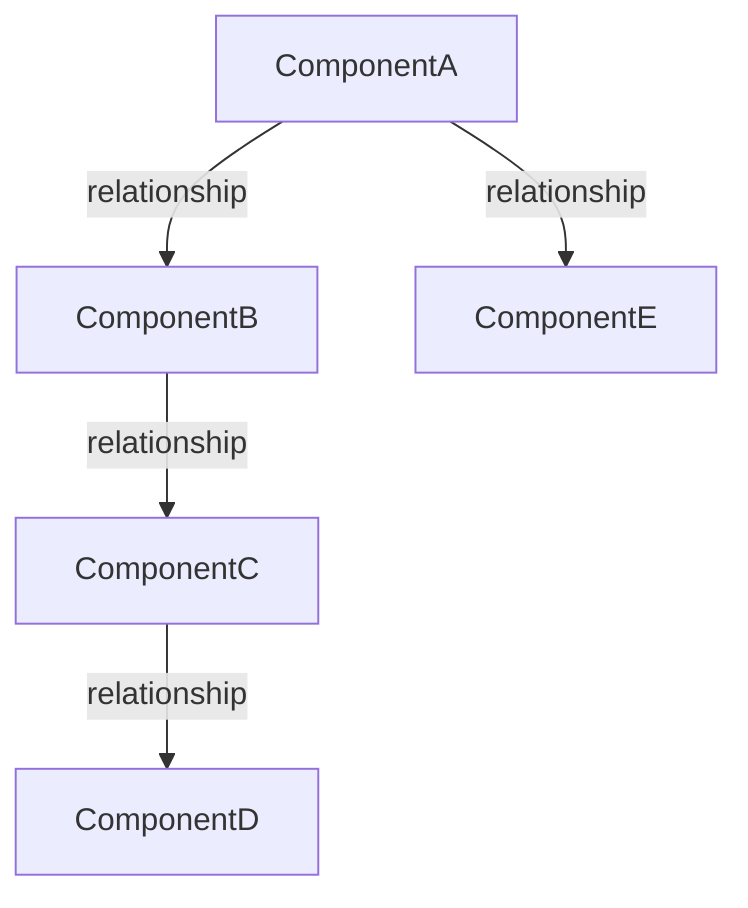
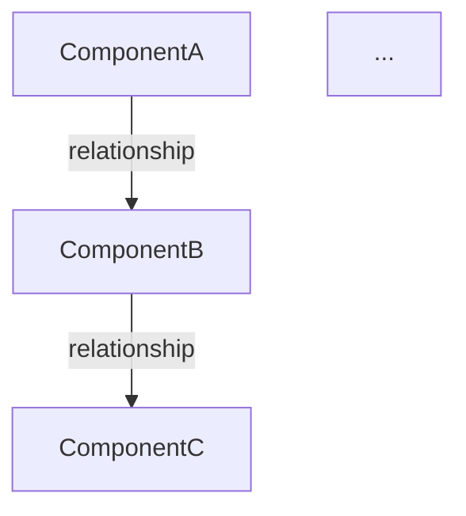

# Tutorial Generator & Analyzer

A unified skill for codebase analysis and tutorial generation. Supports four modes:

- **`/tutorial analyze`** - Fast codebase analysis (3-stage pipeline)
- **`/tutorial build`** - Complete tutorial generation (6-stage pipeline)
- **`/tutorial preview`** - Local docs preview using HonKit
- **`/tutorial doctor`** - Diagnose docs/runtime setup issues

## Quick Reference

```bash
# Quick analysis
/tutorial analyze .

# Full tutorial generation
/tutorial build .

# Preview generated tutorial docs
/tutorial preview ./tutorials

# Diagnose local docs/runtime issues
/tutorial doctor ./tutorials

# Repair bundled HonKit runtime (if preview/doctor says runtime missing)
# (Run from your local `tutorial-skill` git checkout)
# node ./bin/cli.js docs runtime install

# With arguments
/tutorial analyze ./src/main/java
/tutorial build --output ./docs/tutorial
/tutorial preview --path ./docs/tutorial
/tutorial doctor --path ./docs/tutorial
```

---

# Mode 1: Analyze (`/tutorial analyze`)

**Purpose**: Quickly understand any codebase by identifying core components and their relationships.

**Time**: 2-5 minutes for most projects
**Output**: Interactive summary with architecture diagram

## When to Use Analyze Mode

- Onboarding to a new repository
- Understanding project architecture
- Planning refactoring work
- Code review preparation
- Quick structural overview

## Analyze Pipeline (3 Stages)

### Stage 1: Code Discovery

**Instructions**:
1. Determine project details:
   - If user provided path in command (e.g., `/tutorial analyze ./src`), use that
   - Otherwise ask: "What directory should I analyze?"
   - Auto-detect primary language from file extensions
   - Ask if they want to focus on specific areas (optional)

2. Find source files using Glob:
   - **Java**: `**/*.java` (exclude `**/test/**`, `**/target/**`)
   - **Python**: `**/*.py` (exclude `**/test/**`, `**/__pycache__/**`, `**/venv/**`)
   - **JavaScript/TypeScript**: `**/*.{js,ts,jsx,tsx}` (exclude `**/node_modules/**`, `**/dist/**`, `**/build/**`)
   - **Go**: `**/*.go` (exclude `**/*_test.go`, `**/vendor/**`)
   - **C#**: `**/*.cs` (exclude `**/bin/**`, `**/obj/**`)
   - **Ruby**: `**/*.rb` (exclude `**/spec/**`, `**/test/**`)
   - **Rust**: `**/*.rs` (exclude `**/target/**`)
   - **PHP**: `**/*.php` (exclude `**/vendor/**`, `**/tests/**`)

3. Handle large codebases:
   - If >50 files found, ask: "Found {N} files. Analyze all or focus on specific subdirectory?"
   - Suggest core directories: `src/main`, `lib`, `app`, etc.

4. Read discovered files with Read tool
5. Report: "Found {N} files totaling {LOC} lines of code"

---

### Stage 2: Identify Core Abstractions

**System Prompt**:
```
You are a senior software architect analyzing a codebase.

Your task is to identify the core abstractions - the main concepts, classes, modules, or patterns that define this codebase's architecture.

For each abstraction, provide:
1. **name**: A concise, clear name for the concept
2. **description**: A 2-3 sentence explanation of what it does and why it exists (use simple, beginner-friendly language with analogies where helpful)
3. **category**: Classify as one of: "Model/Entity", "Service/Business Logic", "Controller/Handler", "Repository/Data Access", "Utility/Helper", "Configuration", "Interface/Contract", "Middleware", "Other"
4. **relevantFiles**: Array of file paths where this abstraction is primarily defined or used
5. **importance**: Rate as "core", "supporting", or "auxiliary"

Focus on the most important abstractions. Aim for 5-15 key concepts depending on codebase complexity.

Return a JSON object with a single key "abstractions" containing an array of abstraction objects.

Example:
{
  "abstractions": [
    {
      "name": "UserService",
      "description": "Handles all business logic related to user management, including registration, authentication, and profile updates. Think of it as the conductor that orchestrates user-related operations.",
      "category": "Service/Business Logic",
      "relevantFiles": ["src/services/UserService.java", "src/services/AuthService.java"],
      "importance": "core"
    }
  ]
}
```

**User Prompt**:
```
Project Name: {project_name or "Unknown Project"}
Primary Language: {detected_language}

Analyze the following codebase:
---
{concatenated_file_contents}
```

**Display Results**:
```markdown
## 🔍 Core Abstractions Found ({N} total)

### 🎯 Core Components ({count})
- **ComponentName**: Brief description
- **AnotherComponent**: Brief description

### 🔧 Supporting Components ({count})
- **HelperName**: Brief description

### 📦 Auxiliary Components ({count})
- **UtilityName**: Brief description
```

---

### Stage 3: Analyze Relationships

**System Prompt**:
```
You are a software architect analyzing component relationships.

Given a list of abstractions and the codebase, identify how these components interact.

Provide:
1. **summary**: A 3-5 sentence high-level overview of:
   - The project's main purpose
   - The architectural style (MVC, layered, microservices, etc.)
   - The primary data flow or request flow
   Use markdown formatting with **bold** for key concepts.

2. **relationships**: Array of relationships between abstractions, where each includes:
   - **from**: Source abstraction index and name (format: "0 # AbstractionName")
   - **to**: Target abstraction index and name (format: "1 # OtherAbstraction")
   - **description**: Short phrase describing the relationship (e.g., "uses for data access", "extends", "validates input for", "sends events to")
   - **type**: Classify as "dependency", "inheritance", "composition", "calls", "data-flow", or "event"

Requirements:
- Every abstraction must appear in at least one relationship
- Focus on significant relationships - exclude trivial ones
- Prefer relationships backed by actual code interactions (method calls, field references)
- Limit to ~2-3 relationships per abstraction to avoid clutter

Return JSON: {"summary": "...", "relationships": [...]}
```

**User Prompt**:
```
Project: {project_name}
Language: {language}

Abstractions (numbered):
{numbered_list_of_abstractions_with_descriptions}

Codebase:
{concatenated_file_contents}
```

**Display Results**:
```markdown
## 📊 Project Overview

{summary_text}

## 🏗️ Architecture Diagram



## 🔗 Key Relationships ({N} total)

1. **ComponentA** → **ComponentB**: description of relationship
2. **ComponentB** → **ComponentC**: description of relationship
...
```

**Offer Follow-up**:
```
✅ Analysis complete!

Would you like me to save the architecture diagram to disk?
- The diagram will be saved as a Mermaid (.mmd) file
- You can also get a full Markdown analysis file
- Reply "yes" to save diagram, "markdown" for full analysis, or "skip" to continue

Other options:
- 🔎 Deep dive into a specific component?
- 📚 Generate a full tutorial with this? (use /tutorial build)
- ❓ Answer questions about the architecture?
```

**If user wants to save diagram**:
1. Ask for filename (default: `architecture-diagram.mmd`)
2. Create the Mermaid file with just the diagram content:

3. Confirm: "✅ Diagram saved to `{filename}`"

**If user wants full markdown analysis**:
1. Ask for filename (default: `codebase-analysis.md`)
2. Include all content from Stages 2-3:
   - Core Abstractions section
   - Project Overview
   - Architecture Diagram (embedded mermaid)
   - Key Relationships
3. Confirm: "✅ Analysis saved to `{filename}`"

---

# Mode 2: Build (`/tutorial build`)

**Purpose**: Transform any codebase into comprehensive, beginner-friendly tutorials.

**Time**: 10-30 minutes depending on project size
**Output**: Multiple Markdown files plus HonKit-ready navigation files

## When to Use Build Mode

- Creating learning materials
- Documenting code for beginners
- Internal training resources
- Open source project tutorials
- Educational content

## Build Pipeline (6 Stages)

### Stages 1-3: Same as Analyze Mode

The build mode runs the same first 3 stages as analyze mode:
1. Code Discovery
2. Identify Abstractions
3. Analyze Relationships

---

### Stage 4: Organize Chapters

**Goal**: Determine the pedagogical order for teaching concepts.

**System Prompt**:
```
You are a technical writer planning a tutorial for beginners.

Given a list of topics (abstractions), determine the best order to teach them.

Principles:
- Start with foundational concepts (models, core interfaces)
- Progress to data access (repositories, DAOs)
- Then business logic (services)
- Then presentation layer (controllers, views)
- End with cross-cutting concerns (authentication, validation, utilities)

Consider dependencies: teach dependencies before dependents.

Return JSON with a single key "chapters" containing an array of objects with field "name".

Example:
{
  "chapters": [
    {"name": "User"},
    {"name": "UserRepository"},
    {"name": "UserService"},
    {"name": "UserController"}
  ]
}
```

**User Prompt**:
```
Abstractions to organize: {comma_separated_names}

Context (relationships):
{relationship_summary}
```

**User Confirmation**:
```
📋 Suggested Chapter Order:

1. Configuration
2. User Model
3. UserRepository
4. UserService
5. AuthenticationFilter
6. UserController

Does this order make sense?
- Reply "yes" to continue
- Suggest changes if needed
- Or provide your preferred order
```

---

### Stage 5: Generate Tutorial Metadata

**System Prompt**:
```
You are an expert technical writer creating metadata for programming tutorials.

Generate a JSON object with these fields:

- **title**: Concise, descriptive title (e.g., "Building a REST API with Spring Boot")
- **description**: 2-3 sentence paragraph summarizing:
  - The project's goal
  - Technologies used
  - What developers will learn
- **repo**: Repository URL or "N/A" if not available
- **author**: Use "Waver Tutorial Generator"
- **language**: Primary programming language (e.g., "Java", "Python")
- **tags**: Array of 5-7 relevant lowercase tags (include language, frameworks, patterns)
- **difficulty**: One of "beginner", "intermediate", "advanced"
  - beginner: Basic syntax, single concepts, starter projects
  - intermediate: Multiple frameworks, established patterns
  - advanced: Complex architecture, performance optimization, advanced topics
- **estimatedTime**: Rough time estimate (e.g., "2 hours", "1 day", "3-5 hours")
- **prerequisites**: Array of prerequisite skills/knowledge
- **lastUpdated**: Current date in ISO 8601 format (YYYY-MM-DD)

Return only the JSON object, no additional text.
```

**User Prompt**:
```
ProjectName: {project_name}

Abstractions:
{abstractions_json}

Repository URL: {repo_url_or_path}

Relationships Summary:
{summary}
```

**Display to User**:
```
📝 Tutorial Metadata Generated:

Title: "Building a User Management REST API"
Difficulty: Intermediate
Estimated Time: 3-4 hours
Tags: java, spring-boot, rest-api, jpa, authentication

Prerequisites:
- Basic Java knowledge
- Understanding of REST principles
- Familiarity with Maven
```

---

### Stage 6: Write Tutorial Content

**Goal**: Generate introduction and individual chapters as Markdown files.

#### 6a. Generate Introduction

**System Prompt**:
```
You are an expert technical writer creating a tutorial for beginners.
Your tone should be clear, friendly, and encouraging.

Generate an introduction chapter in Markdown format.

Include:
1. **Welcome section**: Friendly greeting explaining what they'll learn
2. **Project Overview**: What this project does and why it's useful
3. **Architecture Overview**:
   - High-level explanation of the architecture
   - Mermaid diagram showing core components and flow
4. **Technical Stack**:
   - Programming language and version
   - Major frameworks/libraries and their purpose
   - Why these technologies were chosen
5. **Database/Data Model** (if applicable):
   - Explanation of data storage approach
   - Mermaid ER diagram if using a database
6. **What You'll Learn**: Bulleted list of key takeaways
7. **Prerequisites**: What readers should know before starting

Use markdown formatting: **bold** for emphasis, *italic* for terms, `code` for technical references.

Make it engaging and accessible to someone new to the codebase.
```

**User Prompt**:
```
All Abstractions in Tutorial:
{abstractions_with_descriptions}
---
Relevant Code Files:
{all_file_contents}
---
Metadata:
{tutorial_metadata}
```

**Output**: Save as `index.md` or `00-introduction.md`

#### 6b. Generate Individual Chapters

For each chapter in the ordered list:

**System Prompt**:
```
You are an expert technical writer creating a tutorial for beginners.
Your tone should be clear, friendly, and encouraging.

Generate a single chapter in Markdown format for the specified topic.

Structure:
1. **Introduction**: What this component is and why it exists (use an analogy)
2. **How It Works**: Explain the main responsibilities and behavior
3. **Code Deep Dive**:
   - Show relevant code snippets
   - Explain key methods/functions
   - Highlight important patterns or techniques
4. **Relationships**: How this component interacts with others (reference other chapters)
5. **Key Takeaways**: 3-5 bullet points summarizing the important concepts
6. **Next Steps**: Preview what's coming in the next chapter

Guidelines:
- Include relevant code snippets from the provided files
- Add inline comments to explain complex code
- Use analogies and real-world examples
- Cross-reference related chapters when appropriate
- Keep explanations beginner-friendly but technically accurate
```

**User Prompt**:
```
All Abstractions in Tutorial: {all_abstraction_names}
---
Current Chapter Topic: {current_abstraction_name}
Current Chapter Description: {current_abstraction_description}
---
Relevant Code Files:
{relevant_files_for_this_abstraction}
---
Related Components:
{related_components_from_relationships}
```

**File Format**:
```markdown
---
title: "Chapter {N}: {ChapterName}"
order: {N}
---

# Chapter {N}: {ChapterName}

[Chapter content here...]
```

**Save as**: `{N:02d}-{chapter-name}.md` (e.g., `01-Configuration.md`, `02-User-Model.md`)

**Processing**:
- Generate chapters **sequentially** to allow cross-referencing
- Show progress: "✓ Chapter 1/5: Configuration complete"
- For efficiency, could generate 2-3 in parallel if they don't reference each other

---

### Final Step: Create HonKit Navigation Files

After generating tutorial chapters, prepare the output for HonKit by default:

1. Ensure there is a root landing page:
   - If `README.md` does not exist and `index.md` exists, copy `index.md` to `README.md`
   - If both are missing, create a minimal `README.md`

2. Create `SUMMARY.md` from ordered chapter files:
```markdown
# Summary

* [Introduction](README.md)
* [Configuration](01-Configuration.md)
* [User Model](02-User-Model.md)
* [UserRepository](03-UserRepository.md)
* [UserService](04-UserService.md)
* [UserController](05-UserController.md)
```

3. Create `book.json` if it doesn't exist:
```json
{
  "title": "Tutorial",
  "plugins": ["mermaid-hybrid"]
}
```

**Completion Message**:
```
✅ Tutorial Generation Complete!

📁 Output Directory: ./tutorials
📄 Files Created:
   - index.md (Introduction)
   - README.md (HonKit landing page)
   - SUMMARY.md (HonKit navigation)
   - book.json (HonKit config)
   - 01-Configuration.md
   - 02-User-Model.md
   - 03-UserRepository.md
   - 04-UserService.md
   - 05-UserController.md

📊 Stats:
   - 5 chapters
   - 8 core components covered
   - ~4 hours estimated reading time

🎯 Next Steps:
   - Review the tutorial
   - Preview locally with `/tutorial preview`
   - Share with your team!
```

---

# Mode 3: Preview (`/tutorial preview`)

**Purpose**: Preview generated tutorial docs locally using bundled HonKit.

**Time**: 5-30 seconds to start
**Output**: Local preview server URL (typically `http://localhost:4000`)

## When to Use Preview Mode

- Reviewing generated tutorial content before publishing
- Validating Mermaid diagram rendering
- Checking chapter navigation and ordering
- Sharing a local preview in team demos

## Preview Workflow

1. Determine preview directory:
   - If user provides path (e.g., `/tutorial preview ./docs/tutorial`), use that
   - Else if `--path` is provided, use that
   - Otherwise default to `./tutorials`

2. Confirm directory exists:
   - If it does not exist, respond with:
     - "I couldn't find `{path}`. Run `/tutorial build --output {path}` first, or provide another path."
   - If it exists, continue

3. Prepare and serve docs with the CLI:
   - Do **not** use `~/.claude/skills/tutorial/bin/cli.js` — the skill install copies `SKILL.md` but does not copy the package `bin/` directory.
   - Prefer local development (before publishing):
     - `node <path-to-tutorial-skill-repo>/bin/cli.js docs preview --dir {path}`
   - After publishing, users can run:
     - `npx @sshaaf/tutorial-skill@latest docs preview --dir {path}`
   - Avoid `npx honkit serve` for validation — it won’t use the bundled runtime/plugins unless you install HonKit + Mermaid into the book directory.
   - This command auto-creates/updates HonKit files (`README.md`, `SUMMARY.md`, `book.json`) if needed

4. Confirm preview details:
   - "✅ Preview started for `{path}`"
   - "Open: `http://localhost:4000`"
   - "Stop server with Ctrl+C"

5. If preview command fails:
   - If `npx @sshaaf/tutorial-skill ...` prints only `install`, you’re on an older published npm version — use the local repo CLI (`node .../bin/cli.js ...`) until you publish.
   - If preview fails because HonKit runtime is missing/out of date:
     - Local dev repair: `node <path-to-tutorial-skill-repo>/bin/cli.js docs runtime install`
   - Suggest reinstalling to refresh bundled runtime:
     - `rm -rf ~/.claude/skills/tutorial`
     - Local dev install (from repo): `node bin/cli.js install`
     - Published install (after release): `npx @sshaaf/tutorial-skill@latest install`

---

# Mode 4: Doctor (`/tutorial doctor`)

**Purpose**: Diagnose local docs preview issues before publishing.

**Time**: 10-30 seconds
**Output**: Pass/fail checklist with fixes

## Doctor Workflow

1. Resolve target directory:
   - If path provided (e.g., `/tutorial doctor ./docs/tutorial`), use it
   - Else if `--path` provided, use it
   - Otherwise default to `./tutorials`

2. Run CLI diagnostics:
   - Prefer local development (before publishing):
     - `node <path-to-tutorial-skill-repo>/bin/cli.js docs doctor --dir {path}`
   - After publishing:
     - `npx @sshaaf/tutorial-skill@latest docs doctor --dir {path}`

3. Report results clearly:
   - If checks pass: confirm runtime/plugin/docs are healthy
   - If checks fail: show the exact failing checks and include the suggested fix commands

4. Common fixes to suggest:
   - `rm -rf ~/.claude/skills/tutorial`
   - Local dev install (from repo): `node bin/cli.js install`
   - Published install (after release): `npx @sshaaf/tutorial-skill@latest install`
   - Local dev docs helpers:
     - `node <path-to-tutorial-skill-repo>/bin/cli.js docs runtime install`
     - `node <path-to-tutorial-skill-repo>/bin/cli.js docs init --dir {path}`
     - `node <path-to-tutorial-skill-repo>/bin/cli.js docs preview --dir {path}`

---

# Usage Instructions

## Argument Parsing

When the skill is invoked, check for arguments:

```python
# Pseudo-code for argument handling
if invoked_as == "/tutorial analyze" or mode == "analyze":
    run_analyze_mode()
elif invoked_as == "/tutorial build" or mode == "build":
    run_build_mode()
elif invoked_as == "/tutorial preview" or mode == "preview":
    run_preview_mode()
elif invoked_as == "/tutorial doctor" or mode == "doctor":
    run_doctor_mode()
elif no_mode_specified:
    ask_user: "Would you like to analyze, build, preview, or doctor a tutorial?"
```

## Supported Arguments

Supported arguments:
- **Path**: `/tutorial analyze ./src/main/java`
- **Output**: `/tutorial build --output ./docs`
- **Language**: `/tutorial analyze --language python`
- **Focus**: `/tutorial analyze --focus services`
- **Preview Path**: `/tutorial preview ./docs/tutorial` or `/tutorial preview --path ./docs/tutorial`
- **Doctor Path**: `/tutorial doctor ./docs/tutorial` or `/tutorial doctor --path ./docs/tutorial`

Parse arguments flexibly - accept flags or positional args.

## Error Handling

- **No files found**: Verify path and suggest alternatives
- **Too many files**: Recommend focusing on subdirectory
- **JSON parse error**: Show raw LLM output and retry
- **Missing relationships**: Some components can be standalone (OK)
- **User cancels**: Respect cancellation at any stage

## Progress Updates

Show clear progress at each stage:
```
/tutorial build .

📦 Tutorial Generator - Build Mode

⏳ Stage 1/6: Discovering source files...
✓ Found 23 files (4,521 lines)

⏳ Stage 2/6: Identifying abstractions...
✓ Identified 8 core components

⏳ Stage 3/6: Analyzing relationships...
✓ Mapped 14 interactions

[... continues ...]
```

## Tips for Best Results

### For Analyze Mode
- Focus on specific modules for large projects
- Ask follow-up questions after analysis
- Export results if you want to share

### For Build Mode
- Review chapter order before generation starts
- Specify target audience for better content
- Generate tutorials for one module at a time in large projects
- Regenerate individual chapters if needed
- By default, outputs are prepared for HonKit local preview

---

# Example Invocations

## Analyze Examples

```bash
# Basic analysis
/tutorial analyze .

# Analyze specific directory
/tutorial analyze ./src/services

# With language hint
/tutorial analyze ./app --language typescript

# Focus on specific layer
/tutorial analyze ./backend --focus "authentication and authorization"
```

## Build Examples

```bash
# Basic tutorial generation
/tutorial build .

# With output directory
/tutorial build --output ./docs/tutorial

# Complete specification
/tutorial build ./src/main/java --output ./tutorials --name "Spring Boot API" --audience intermediate

# Preview generated docs locally (HonKit default engine)
node <path-to-tutorial-skill-repo>/bin/cli.js docs preview --dir ./docs/tutorial

# After publishing a new npm version:
# npx @sshaaf/tutorial-skill@latest docs preview --dir ./docs/tutorial
```

## Preview Examples

```bash
# Preview default tutorial output directory
/tutorial preview

# Preview specific directory
/tutorial preview ./docs/tutorial

# Preview specific directory with flag
/tutorial preview --path ./docs/tutorial
```

## Doctor Examples

```bash
# Diagnose default output directory
/tutorial doctor

# Diagnose specific tutorial directory
/tutorial doctor ./docs/tutorial

# Diagnose specific directory with flag
/tutorial doctor --path ./docs/tutorial
```

## Interactive Example

```
User: /tutorial analyze .

Claude: I'll analyze your codebase. What directory should I analyze?

User: ./src/main/java

Claude:
⏳ Discovering source files...
✓ Found 18 Java files (3,245 lines)

⏳ Identifying abstractions...
✓ Found 9 core components

[Shows architecture diagram and summary]

Would you like me to:
- Deep dive into a specific component?
- Generate a full tutorial? (use /tutorial build)
- Export this analysis?

User: Generate a full tutorial

Claude:
Great! I'll generate a comprehensive tutorial.

[Asks configuration questions...]
[Runs stages 4-6...]
[Creates tutorial files...]

✅ Complete! Tutorial saved to ./tutorials
```

---

**Remember**:
- **Analyze** is fast and interactive (3 stages)
- **Build** is comprehensive and creates files (6 stages)
- **Preview** launches local HonKit docs for generated tutorials
- **Doctor** validates runtime/plugin/docs health before publishing
- All modes work with any programming language
- All modes provide progress updates and allow user input
