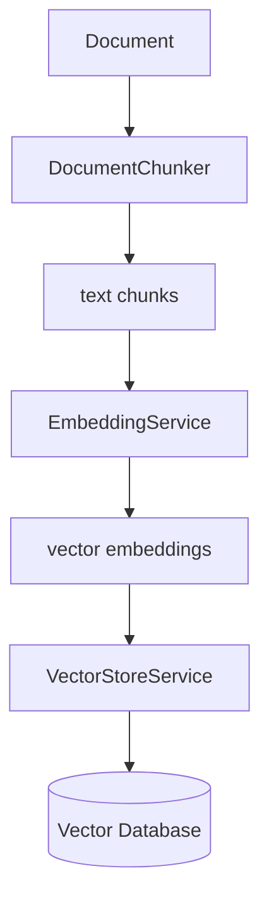
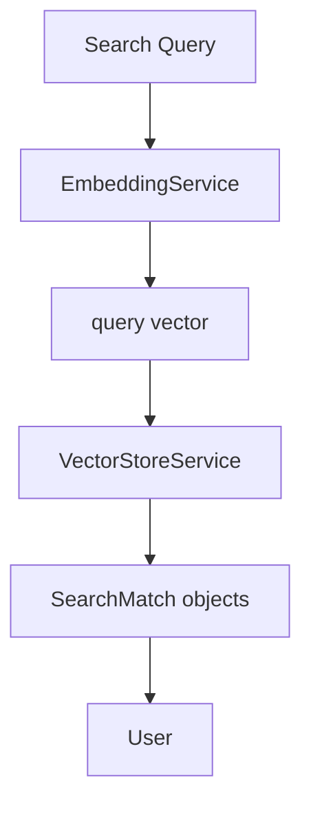
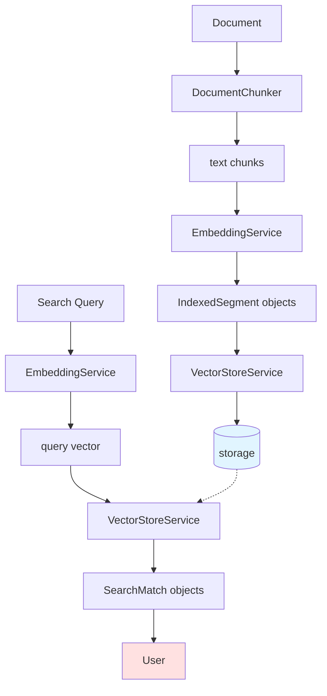
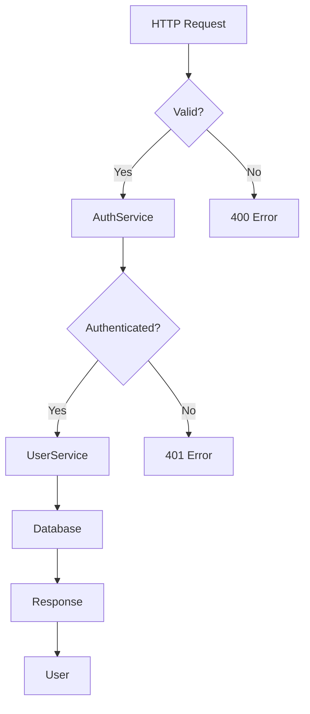
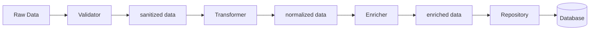
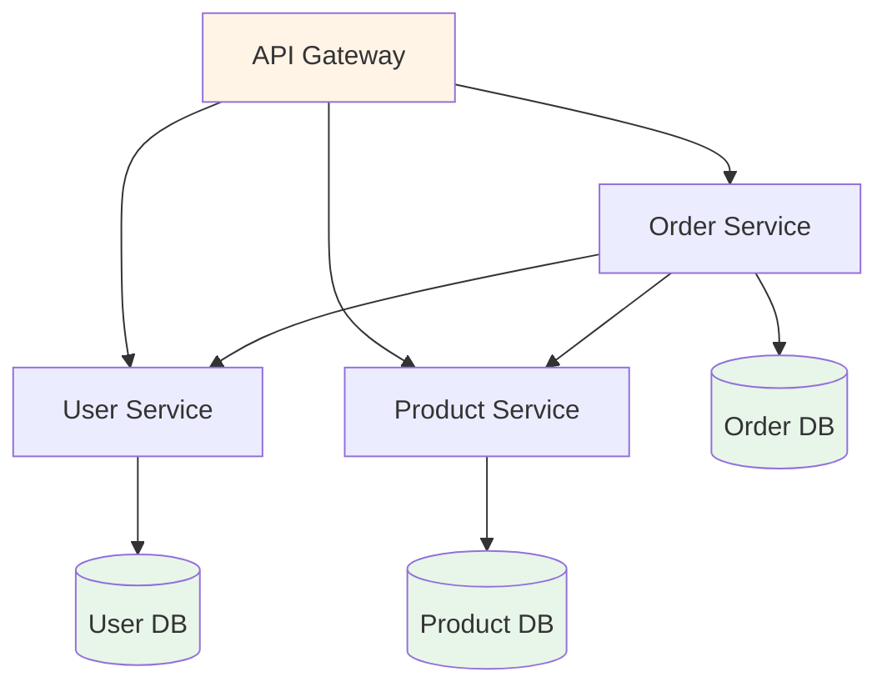

# Flow Diagram Examples

This file contains example flow diagrams in Mermaid format to guide tutorial generation. Flow diagrams show how data moves through the system and transforms at each step.

## Example 1: Document Indexing Flow



**Description**: Shows how a document is processed into searchable vectors and stored.

---

## Example 2: Search Query Flow



**Description**: Shows how a search query is converted to a vector and matched against stored vectors.

---

## Example 3: Combined Flow with Decision Points



**Description**: Shows both indexing and search flows, with storage connecting them.

---

## Example 4: Request Processing Flow with Error Handling



**Description**: Shows request flow through authentication with error handling branches.

---

## Example 5: Data Transformation Pipeline



**Description**: Shows data moving through multiple transformation stages.

---

## Example 6: Microservices Communication



**Description**: Shows service-to-service communication in a microservices architecture.

---

## Best Practices for Flow Diagrams

### When to Use Flow Diagrams
- Show data transformation through multiple components
- Illustrate request/response cycles
- Demonstrate decision points and branching
- Explain pipeline or workflow processes

### Flow Diagram Guidelines

**Use different node shapes for different purposes**:
- `[Rectangle]` - Process or component
- `[(Database)]` - Data storage
- `{Diamond}` - Decision point
- `[text in brackets]` - Data or intermediate results

**Arrow styles**:
- `-->` - Primary flow
- `-.->` - Reference or lookup
- `==>` - Important/emphasized flow

**Use descriptive labels**:
- ✅ `[text chunks]` - Clear data description
- ✅ `[vector embeddings]` - Specific transformation result
- ❌ `[data]` - Too vague

**Keep it focused**:
- Show one complete flow per diagram
- Don't try to show everything in one diagram
- Break complex flows into multiple diagrams

**Add visual cues**:
- Use colors to highlight important nodes: `style NodeA fill:#e1f5ff`
- Use different colors for different types (input, output, storage)
- Keep color scheme consistent across diagrams

### Mermaid Syntax Quick Reference

```mermaid
graph TD  %% Top to bottom (TD), Left to right (LR), Bottom to top (BT)
    A[Process] --> B{Decision}
    B -->|Yes| C[Action]
    B -->|No| D[Other Action]
    C --> E[(Database)]
    D -.-> F[Optional Step]

    style E fill:#e1f5ff
```

### Common Flow Patterns

**1. Linear Pipeline**:
```
Input → Process1 → Process2 → Process3 → Output
```

**2. Fan-out**:
```
Input → Router → Process1
              → Process2
              → Process3
```

**3. Fan-in**:
```
Source1 →
Source2 → Aggregator → Output
Source3 →
```

**4. Loop/Retry**:
```
Input → Process → Validate
           ↑         ↓
           ← Retry ← Failed
                    ↓
                 Success → Output
```
